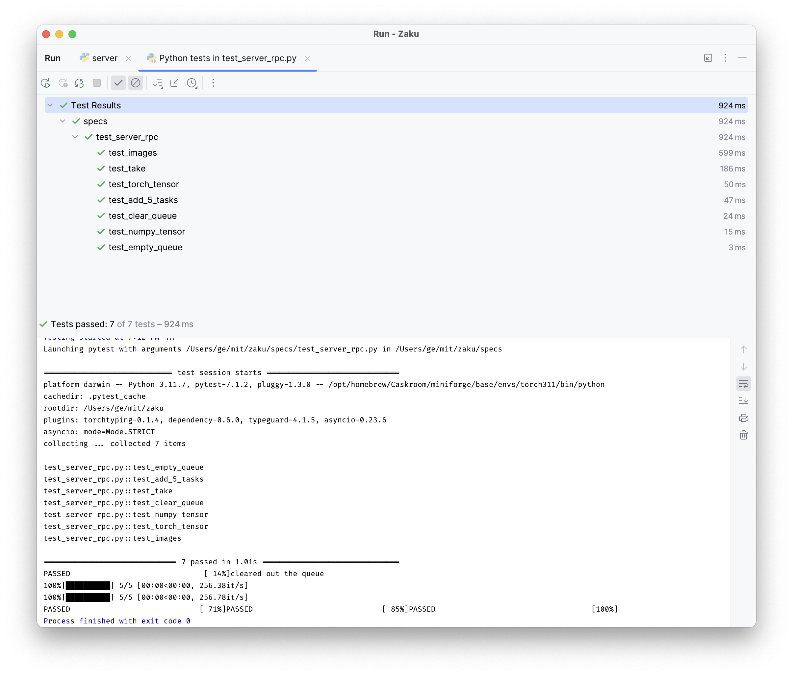

# Zaku, a fast Task Queue for ML Workloads

To get a quick overview of what you can do with `zaku`, check out the following:

- take a look at the basic tutorial or the tutorial for robotics: [Zaku Basics](tutorials/basics)
- or try to take a look at the example gallery [here](examples/01_simple_queue)
- full setup guide for a redis cluster: [docs/tutorials/redis_setup_guide.md](./docs/tutorials/redis_setup_guide.md)

Install zaku --- the latest version is `{VERSION}` on [pypi](https://pypi.org/project/zaku/{VERSION}/).

```python
pip install -U 'zaku[all]=={VERSION}'
```

### Learning Usage Patterns by Running the Tests (specs)

Running tests is the best way to learn how to use a library. To run the tests in the [./specs](./specs) folder, first download and setup `redis-stack-server`. Then start a zaku task queue server at local port `9000`.

1. install zaku and look at the options:
   ```shell
   pip install -U 'zaku[all]=={VERSION}'
   zaku -h
   ```
2. install and run the `redis-stack-server`:
   ```shell
   brew install redis-stack-server
   redis-stack-server
   ```
3. install and run the `mongoDB`:
   ```shell
   brew tap mongodb/brew
   brew install mongodb-community
   brew services start mongodb-community
   ```
4. add .env Environmental variable file:
   ```text
   Configure the environment variables according to the env.template file
   ```
5. run the zaku task queue at port `9000`:
   ```shell
   zaku --port 9000 --verbose
   ```

Now you can run the tests by running

```shell
make test
```

In pycharm, you should see the following:

<p align="center">

</p>

### Example Usage

**Adding Jobs**:

Supposed you have a TaskServer running at `localhost:9000`.

```python
from zaku import TaskQ

queue = TaskQ(name="my-test-queue", uri="http://localhost:9000")

for i in range(100):
    queue.add_job({"job_id": i, "seed": i * 100})
```

**Retrieving Jobs**:

```python
from zaku import TaskQ

queue = TaskQ(name="my-test-queue", uri="http://localhost:9000")

job_id, job = queue.take()
```

Now, after you have finished the job, you need to mark the job for completion. The way we do so is by calling

```python
queue.mark_done(job_id)
```

Sometimes when you worker responsible for completeing the job encounters a failure, you need to also put the job back into the queue so that other workers can retry. You can do so by calling

```python
queue.mark_reset()
```

Now, we offer a context manager `TaskQ.pop`, which automatically catches exceptions and resets the job (or marks it complete).

```python
from zaku import TaskQ

queue = TaskQ(name="my-test-queue", uri="http://localhost:9000")

with queue.pop() as job:
  if job is None:
    print("No job available")
  
  print("Retrieved job:", job)
```

## Developing Zaku (Optional)

First, git clone this repo, and install it in editable mode plus dependencies relevant for building the documentations:

```shell
git clone https://github.com/geyang/zaku.git
cd zaku
pip install -e '.[dev]'
```

### Improving Documentation

We use `sphinx` to generate the documentation. To get started, make sure you install the dev dependencies. This should already be included if you installed zaku via the `zaku[dev]` flag. Take a look at [./docs/requirements.txt](docs/requirements.txt) to see what packages are required for development.

When editing the documentation, you can use a preview server that automatically refreshes the browser upon changes in source. Simply do

```shell
make preview
```

**Note**: restarts are required, when the page index is changes. This includes adding and removing new pages.

To run the full build, call

```shell
make docs
```

### License

Built with :heart: by [@episodeyang](https://x.com/episodeyang). Distributed under the MIT license. See `LICENSE` for more information.
