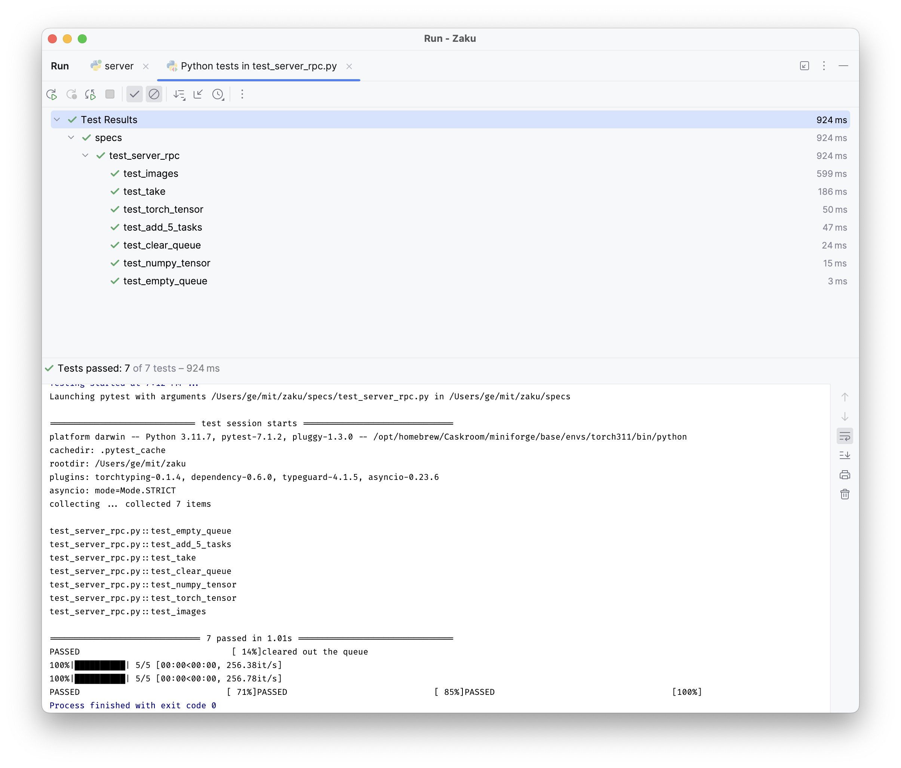

<h1 class="full-width" style="font-size: 49px"><code style="font-family: sans-serif; background-clip: text; color: transparent; background-image: linear-gradient(to right, rgb(255 139 128), rgb(208 6 27), rgb(97 12 0));">Zaku</code> Task Queue<span style="font-size: 0.3em; margin-left: 0.5em; margin-right:-0.4em;">｣</span></h1>

<link rel="stylesheet" href="_static/title_resize.css">

Zaku is a light-weight task queue backed by redis for machine learning workloads. Zaku is built by researchers at MIT in fields including robotics, computer vision, and computer graphics.

- light-weight and performant
- scalable and versatile.
- Open source, licensed under MIT

**To Install:** 

```shell
pip install 'zaku[all]=={VERSION}'
```

```{admonition}
note the single quote `'` around the bracket for `zsh`.
```

Here is an example of how to add and retrieve jobs from Zaku.
For a more comprehensive list of examples, please refer to the [examples](examples/01_simple_queue) page.

```python
from zaku import TaskQ

app = TaskQ(uri="http://localhost:9000")

task_id, task = app.take()
try:
  print("do your things", task)
except Except as e:
  app.mark_reset(task_id)
  raise e
else:
  app.mark_done(task_id)
```

```{admonition} Life Cycle of a task
:class: tip

A task after being created and inserted into the queue, will be taken by a worker, processed, and then marked as done or reset. If the task is marked as done, it will be removed from the queue. If the task is marked as reset, it will be put back into the queue.

In the event of you forgetting to mark the task as done or reset, the task will be marked as reset after a certain amount of time. This is to prevent the task from being stuck in the queue forever. This time is called `ttl` or time-to-live.
```

### <code style="font-size: 1.3em; background-clip: text; color: transparent; background-image: linear-gradient(to right, rgb(255 139 128), rgb(208 6 27), rgb(97 12 0));">zaku</code> in Depth: Running the Tests

The best way to learn how to use <code style="font-size: 1.3em; background-clip: text; color: transparent; background-image: linear-gradient(to right, rgb(255 139 128), rgb(208 6 27), rgb(97 12 0));">zaku</code> is by running the tests in the [./specs](./specs) folder.

To do so, first download and setup `redis-stack-server`. Then start a zaku task queue server at local port `9000`.

1. install zaku and look at the options:
   ```shell
   pip install -U 'zaku[all,dev,examples]=={VERSION}'
   zaku -h
   ```
2. install and run the `redis-stack-server`:
   ```shell
   brew install redis-stack-server
   redis-stack-server
   ```
3. run the zaku task queue at port `9000`:
   ```shell
   zaku --port 9000 --verbose
   ```

Now you can run the tests by running

```shell
make test
```

In pycharm, you should see the following:

<p align="center">

</p>

For a comprehensive documentation on the API, please refer to
the [API documentation on Components | zaku](https://docs.zaku.ai/en/latest/api/zaku.html).

<!-- prettier-ignore-start -->

```{eval-rst}
.. toctree::
   :hidden:
   :maxdepth: 1
   :titlesonly:

   Quick Start <quick_start>
   Report Issues <https://github.com/geyang/zaku/issues?q=is:issue+is:closed>
   CHANGE LOG <CHANGE_LOG.md>
   
.. toctree::
   :maxdepth: 3
   :caption: Tutorials
   :hidden:
   
   tutorials/server_setup.md
   
.. toctree::
   :maxdepth: 3
   :caption: Examples
   :hidden:
   
   Simple Example <examples/01_simple_queue.md>
   PubSub <examples/02_pubsub.md>
   Remote Procedural Calls <examples/03_remote_procedural_call.md>
   
.. toctree::
   :maxdepth: 3
   :caption: Python API
   :hidden:
   
   zaku — TaskQ Client <api/taskq.md>
   zaku.server — TaskServer <api/server.md>
   zaku.interfaces — Types <api/interfaces.md>
   zaku.base <api/base.md>
  
```
