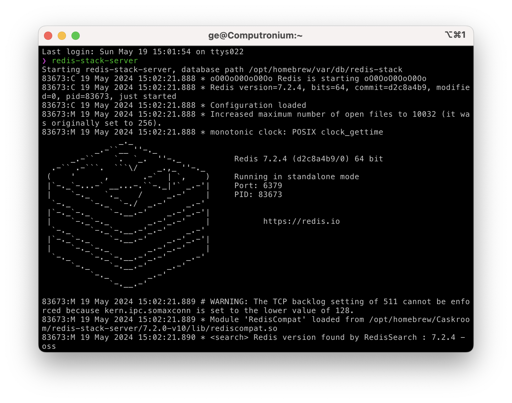

# Setting Up a TaskServer

`Zaku` has two main components: a job queue server connected with a redis store, and a python client. 

You need to set up a `TaskServer` to use the queue. 

## Setting Up a Redis Store

First, you need to have a redis server running. You can install redis using the `redis-stack` docker distribution. This is because the `RedisJSON` module we use is not available in the default redis distribution. 

```{admonition} IMPORTANT: DON'T DO THIS ❌
:class: warning

The default homebrew redis distribution will NOT work ‼️
now running the server this way WILL NOT WORK. This is because the 
default redis distribution does not have the `RedisJSON` module. 
`zaku` relies on the `RedisJSON` module to store the job metadata.

    brew install redis 
    redis                % 👈 this will NOT work
```

✅ Now do this instead: 

```shell
brew tap redis-stack/redis-stack  % tap the redis-stack keg 🍺
brew install redis-stack          % install the redis-stack
```

Now, you can run the redis server with the JSON extension using the following command:

```shell
redis-stack-server
```

you should see something like this: Make sure that it is actually running as
opposed to erroring out.

<p align="center">
  
</p>

